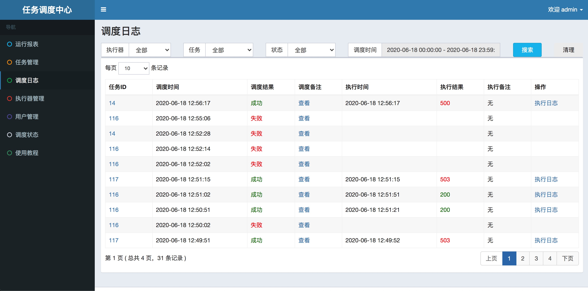

# CloudWrecker使用手册 

目录
=================

  * [任务类型](#任务类型)
  * [运行报表](#运行报表)
  * [任务管理](#任务管理)
     * [搜索](#搜索)
     * [新增](#新增)
        * [资源刷新](#资源刷新)
        * [主要参数](#主要参数)
        * [BEAN任务参数](#bean任务参数)
     * [导入](#导入)
        * [BEAN任务模板](#bean任务模板)
        * [GLUE任务模板](#glue任务模板)
     * [执行一次](#执行一次)
     * [演练模式](#演练模式)
     * [查询日志](#查询日志)
     * [注册节点](#注册节点)
     * [下次执行时间](#下次执行时间)
     * [启动](#启动)
     * [编辑](#编辑)
     * [删除](#删除)
     * [复制](#复制)
     * [Web IDE](#web-ide)
  * [调度日志](#调度日志)
     * [执行结果](#执行结果)
  * [用户管理](#用户管理)
  * [调度状态](#调度状态)
     * [恢复调度](#恢复调度)


## 任务类型
- BEAN任务：故障注入任务，提供参数即可执行故障注入。
- GLUE任务：自定义脚本任务，任务逻辑在Web IDE里面实现。支持java、shell、python、php、nodejs、powershell等语言。

## 运行报表


## 任务管理

### 搜索
根据执行器，任务状态，任务描述，负责人搜索任务，标号1所示功能。

### 新增
标号2所示功能。

#### 资源刷新
更新k8s资源，上图所示**刷新**按钮功能。

#### 主要参数

| 名称    | 意义   | 取值     |
| ------ | ----- | ------- |
| 路由策略 | 当执行器集群部署时选择哪个机器，默认选第一个 | 第一个、最后一个、轮询、随机、一致性HASH、最不经常使用、最近最久未使用、故障转移、忙碌转移 |
| Cron   | cron表达式指定任务触发时间 | **右侧图标**打开编辑界面 | 
| 运行模式 | 指定任务类型，BEAN任务需要指定JobHandler，GLUE任务需要在Web IDE中实现任务逻辑 | BEAN、GLUE(Java)、GLUE(Shell)、GLUE(Python)、GLUE(PHP)、GLUE(Nodejs)、GLUE(PowerShell) |
| JobHandler | 运行模式为BEAN时生效，根据故障类型而定 | PodNetworkJobHandler、ContainerRemoveHandler、PodDeleteJobHandler、NodeNetworkJobHandler、NodeCPUJobHandler、ContainerProcessHandler、ContainerCPUJobHandler、NodeProcessHandler |
| 阻塞处理策略 | 调度过于密集执行器来不及处理时的处理策略，默认选单机串行 | 单机串行、丢弃后续调度、覆盖之前调度 |
| 目标 | 运行模式为BEAN时生效，故障注入的目标 | node、pod、container |
| 类型 | 运行模式为BEAN时生效，指定目标的方式 | 名称、标签 |
| namespace | 运行模式为BEAN时生效，目标所在的namespace | |
| node | 目标为node时生效，指定故障注入的node | |
| pod | 目标为pod时生效，指定故障注入的pod | |
| container | 目标为container时生效，指定故障注入的container | |
| 任务参数 | 传递给执行器的参数。运行模式为BEAN时，格式为"key:val"对，多个kv对使用逗号分隔。运行模式为GLUE时，根据具体的编程语言而定 | 参考[BEAN任务参数](#BEAN任务参数)

#### BEAN任务参数
- 通用参数

  - 通过资源发现选择框设置故障目标
  - 通过evict-count和evict-percent参数来设定实验生效的数量或者百分比
  - 通过timeout参数设置故障生效时间
  - 通过duration参数设置执行器等待故障完成，进行下一个同类型故障注入的时间
    - 设置该参数的目的是为了保证同类型的异常串行执行，在一个异常执行完毕之后，再进行下一个异常的注入。

- JobHandler参数

  | 故障执行器及对应效果                   | 支持参数                                                     |
  | :------------------------------------- | ------------------------------------------------------------ |
  | NodeCPUJobHandler，提高节点CPU的负载   | 通过CPU-percent设置CPU负载百分比                             |
  | NodeNetworkJobHandler，节点网络故障    | 1.提供delay、dns、loss三种类型的网络异常（分别为网络延迟、篡改 dns 域名解析、网络丢包）；2.每个异常的具体参数较多，可参考chaosblade文档查看参数设置 |
  | NodeProcessJobHandler，节点进程故障    | 1.提供kill和stop两种针对进程的异常（分别为杀死进程、挂起进程）；2.通过process参数设置进程关键词，会查找启动命令行中包含该关键词的进程；3.通过process-cmd参数设置进程命令，会查找启动的进程命令中与该关键词匹配的进程 |
  | PodDeleteJobHandler，删除Pod故障       | 该异常无需设置timeout和duration参数                          |
  | PodNetworkJobHandler，Pod网络故障      | 同NodeNetworkJobHandler异常参数相同                          |
  | ContainerProcessHandler，容器进程故障  | 同NodeProcessJobHandler异常参数相同                          |
  | ContainerRemoveHandler，删除容器故障   | 该异常无需设置timeout和duration参数                          |
  | ContainerCPUJobHandler,提高容器CPU负载 | 通过CPU-percent设置CPU负载百分比                             |
  | apiFaultJobHandler，针对api的故障 | url，weight，faultAction，percentage，duration，delayTime，fault_code |
  | SyscallFaultJobHandler，针对系统调用的故障 | inject取error或delay，pid指定受影响的进程，syscall-name指定注入故障的系统调用，return-val指定返回值，time指定延迟的时间，delay-loc指定延迟发生的位置，first和end指定故障注入的区间，step指定故障间隔 |


### 导入
通过导入json格式文件来批量生成任务，该json文件**必须包含json数组**。标号3所示功能。

#### BEAN任务模板
```json
[
    {
        "executor": 1,
        "jobDesc": "node故障",
        "jobType": "BEAN",
        "jobCron": "1 1 1 * * ? *",
        "executorRouteStrategy": "FIRST",
        "executorBlockStrategy": "SERIAL_EXECUTION",
        "executorFailRetryCount": 0,
        "author": "张三",
        "alarmEmail": "",
        "jobPriority": 100,
        "childJobId": "14",
        "triggerStatus": 1,
        "jobDetail": {
            "jobHandler": "demoJobHandler",
            "target": "node",
            "type": "name",
            "namespace": "default",
            "node": "192.168.14.18",
            "executorParam": "pid:100"
        }
    }
]

```

#### GLUE任务模板
```json
[
    {
        "executor": 1,
        "jobDesc": "shell任务",
        "jobType": "GLUE_SHELL",
        "jobCron": "1 1 1 * * ? *",
        "executorRouteStrategy": "FIRST",
        "executorBlockStrategy": "SERIAL_EXECUTION",
        "executorFailRetryCount": 0,
        "author": "张三",
        "alarmEmail": "",
        "jobPriority": 100,
        "childJobId": "14",
        "triggerStatus": 1,
        "jobDetail": {
            "source": "#!/bin/bash\r\necho 'hello shell'\r\n",
            "remark": "test",
            "executorParam": "pid:100"
        }
    }
]
```

### 执行一次
手动触发任务执行，标号4所示功能。
### 演练模式
任务被调度但不执行，可用来检查故障注入环境是否满足。标号5所示功能。
### 查询日志
查看任务执行的历史日志，标号6所示功能。
### 注册节点
查看已注册的执行器，标号7所示功能。
### 下次执行时间
查看任务未来的触发时间，标号8所示功能。
### 启动
启动任务，当到达Cron表示式所指定的时间点时，任务将被触发。没有启动的任务就算到达时间点也不会触发。标号9所示功能。
### 编辑
更新任务参数设置，除了运行模式，其他参数都可以更改。标号10所示功能。
### 删除
删除该任务。标号11所示功能。
### 复制
复制任务。标号12所示功能。

### Web IDE
**GLUE类型**任务才具有**Web IDE**选项


Web IDE界面


## 调度日志

### 执行结果
- 200: 任务执行成功
- 500: 任务执行失败，非环境原因
- 503: 因环境不满足注入条件或注入后环境无法恢复导致任务失败

## 用户管理
管理员可见，一般用户不可见。


## 调度状态
### 恢复调度
点击调度开关恢复调度。


